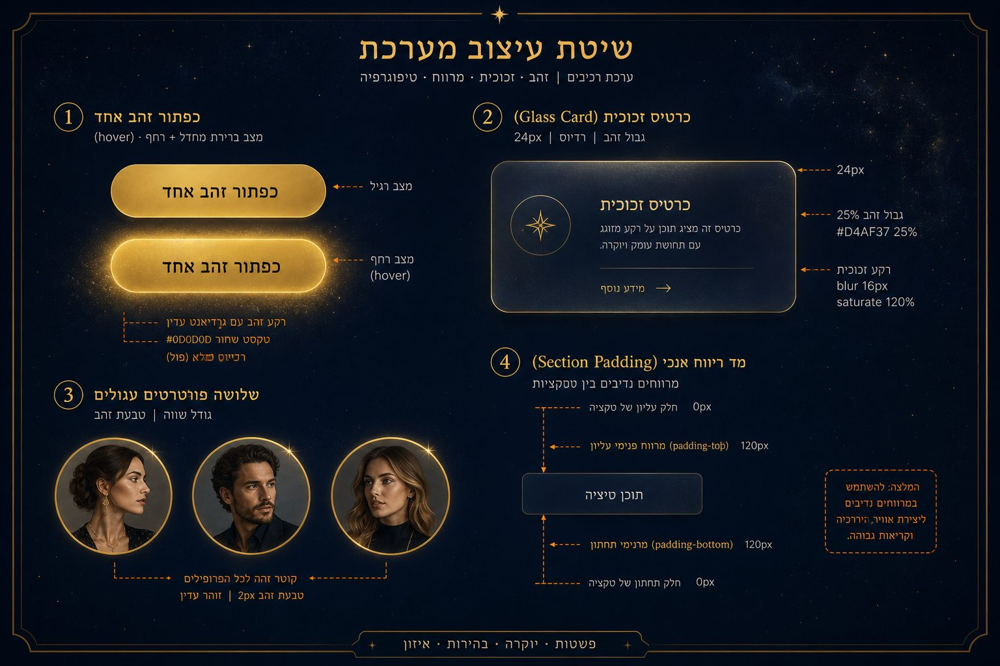
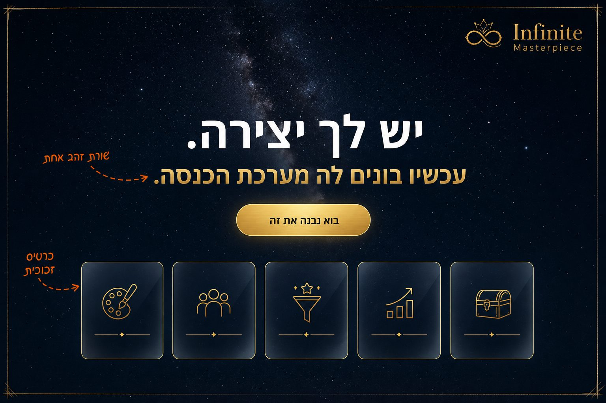
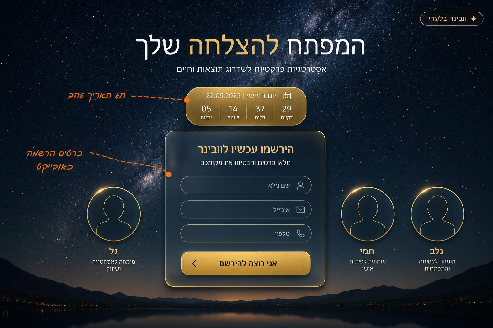
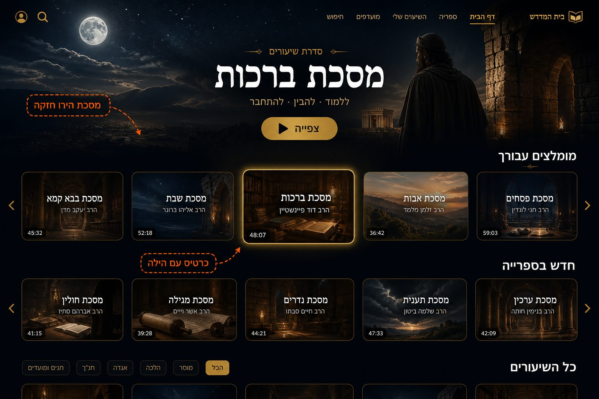
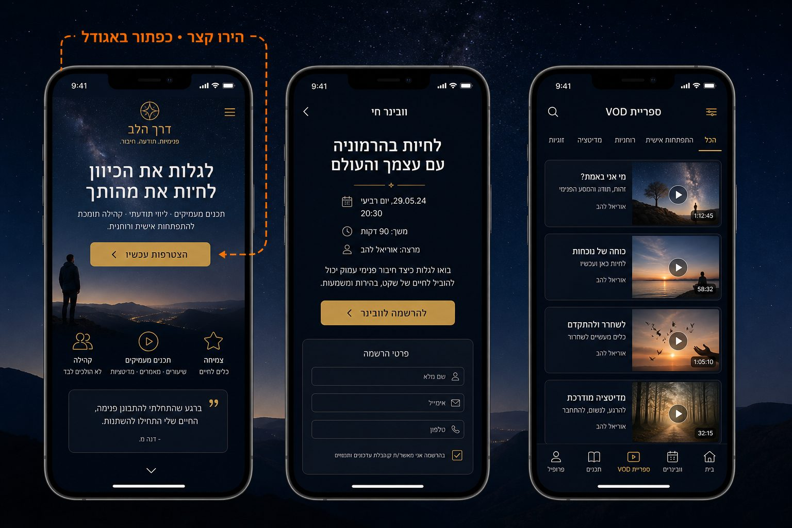
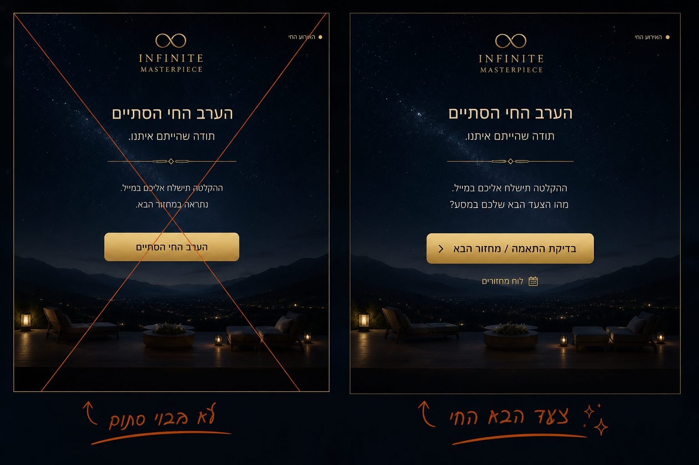
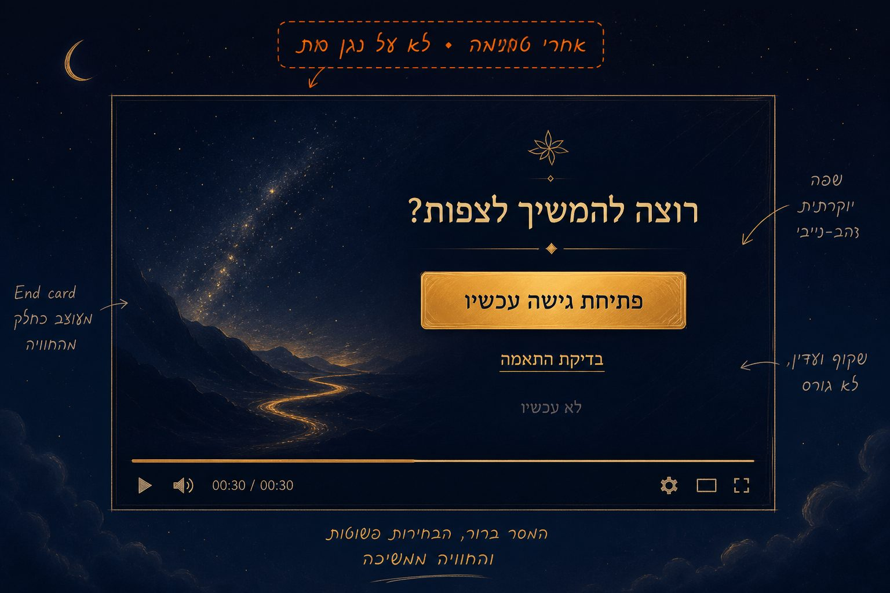
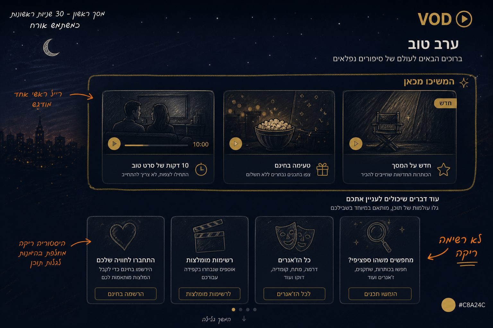

# סקיצת שדרוג עיצוב וחוויה

איור לפני ביצוע. לא קוד במוצר. לא שלב 2. לא מערבבים מסע עם מנוי ספרייה.

לוח אינטראקטיבי (עברית מדויקת + איורים): [`design-upgrade/sketch.html`](design-upgrade/sketch.html)

האיורים הם כיוון ויזואלי. הטקסט בעברית בלוח ה־HTML הוא המקור.

## שמונה מסכים

| מסך | מה רואים | איור |
| --- | --- | --- |
| שפה | כפתור זהב אחד, כרטיס זכוכית, דיוקנאות, ריווח |  |
| אתר שיווקי | הירו גדול, שורת זהב אחת, חמישה כרטיסי זכוכית |  |
| וובינר | כרטיס הרשמה כאובייקט, תג תאריך, שלושה פנים |  |
| ספרייה | מסכת הירו, כרטיסי 16:9 עם הילה |  |
| מובייל | הירו קצר, כפתור באגודל |  |
| CTA חי | לא «הערב הסתיים» בזהב — צעד הבא |  |
| אחרי טעימה | כרטיס סיום, לא Paywall על נגן מת |  |
| המשיכו מכאן | 10 דקות / טעימה / חדש במקום ריק |  |

## מה לא בסקיצה

תגובות, שאלות למרצה, AI, Pods, אפליקציה, גיימיפיקציה, הבטחת הכנסה, CTA ספרייה על דף המסע.
