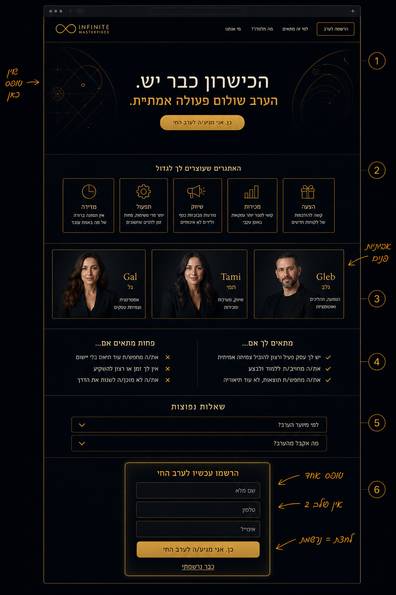
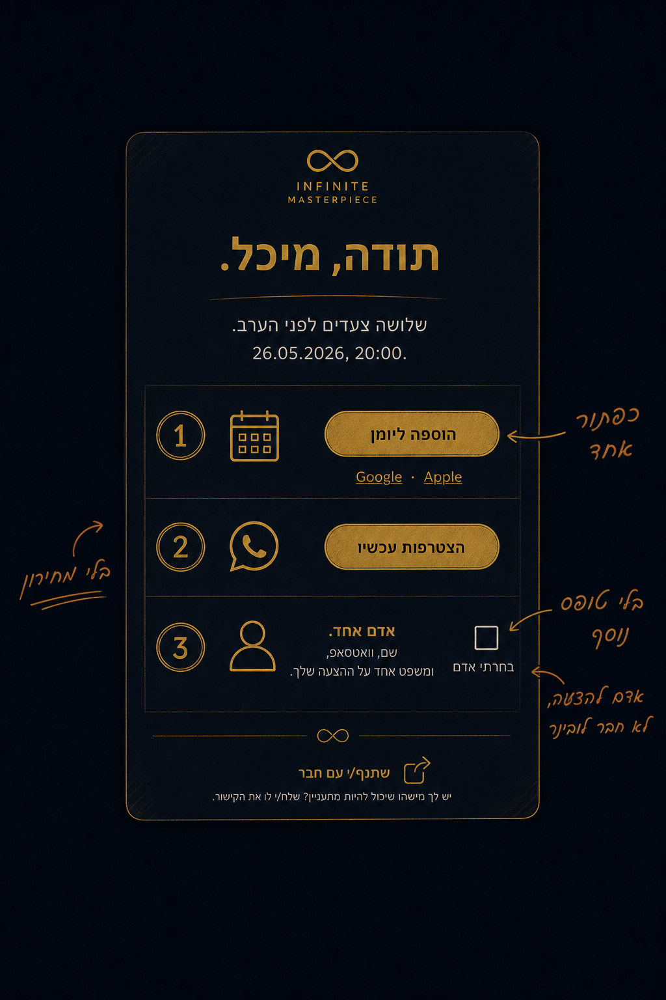
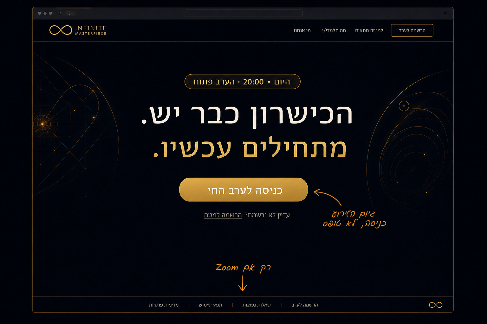
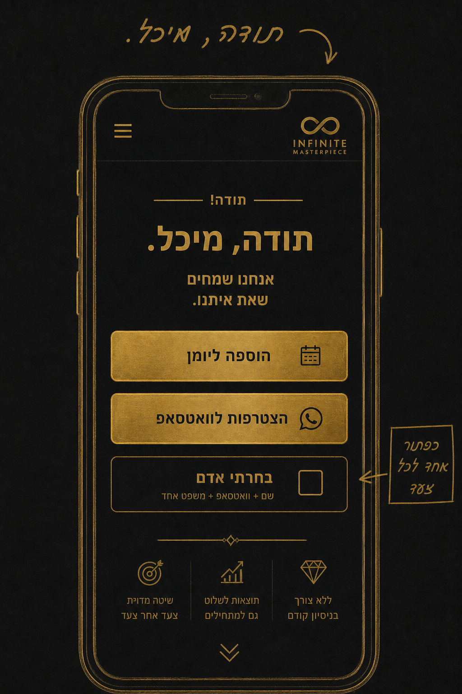
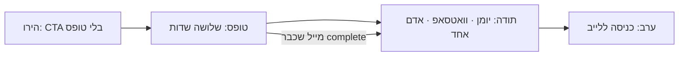
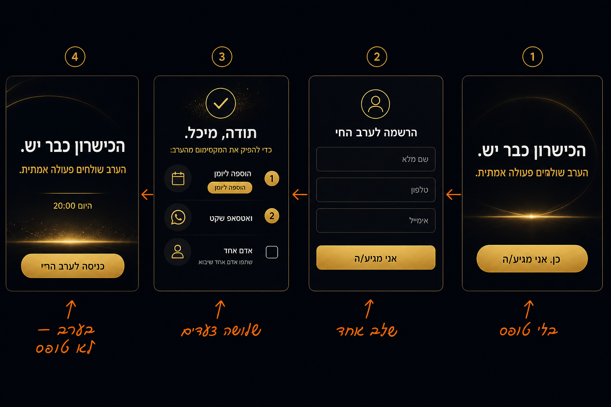
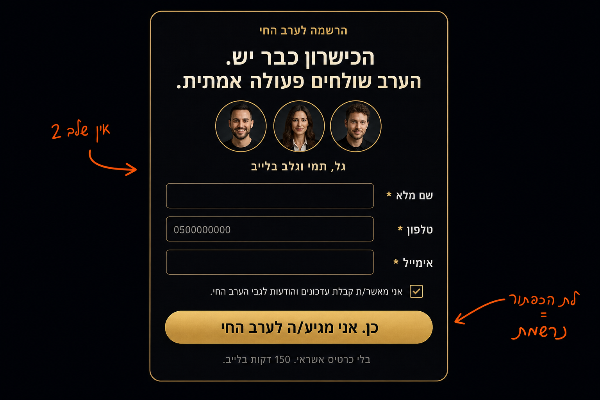
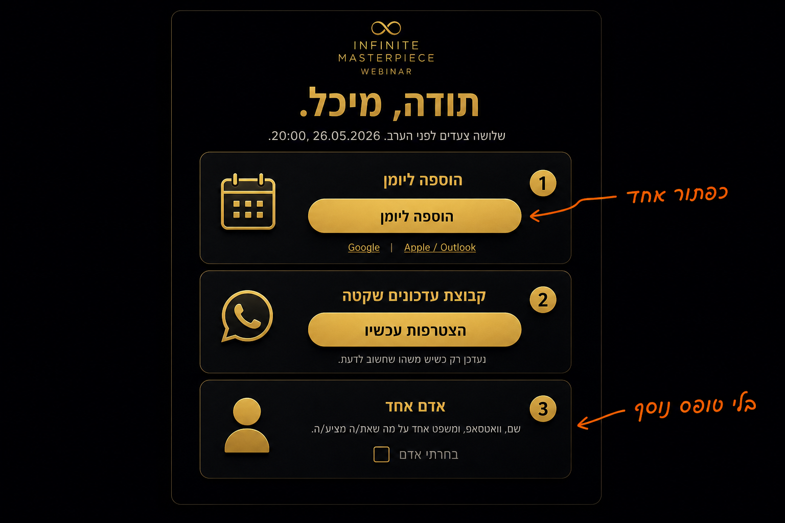
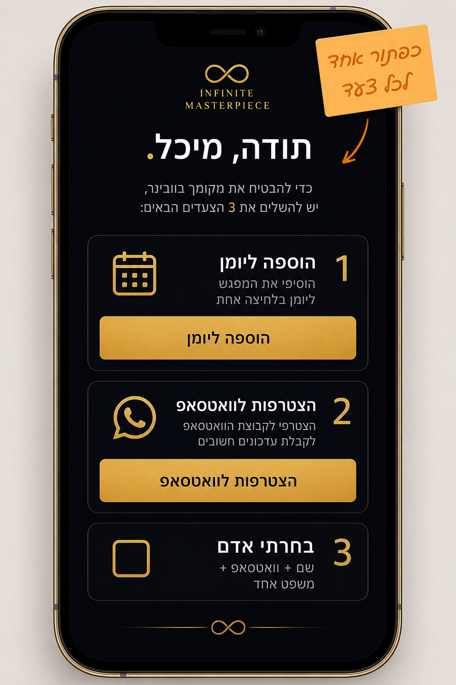
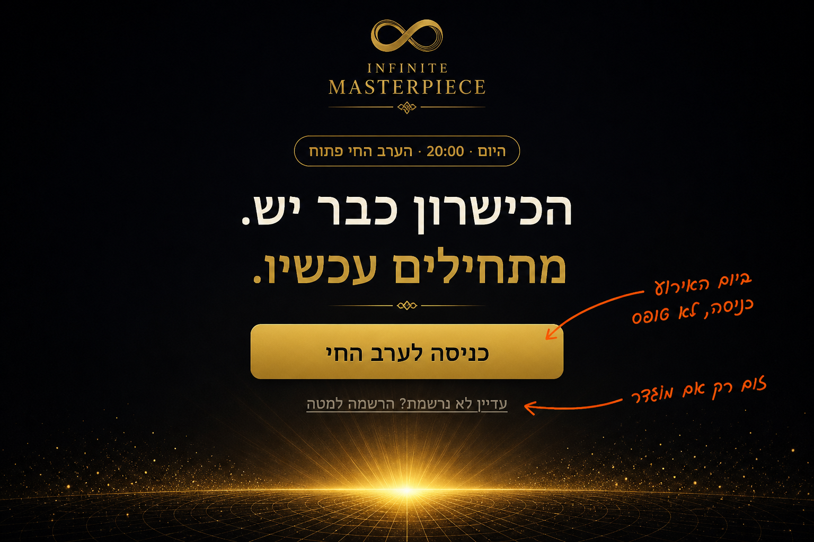

# סקיצת CX — אחרי ההרשמה ועד הכניסה לערב

איור לפני ביצוע. לא קוד במוצר. לא מחירים. לא CTA לספרייה.

הקופי בדף נשאר של Infinite Masterpiece. ששת מקטעי הנחיתה לא משתנים — רק מקצרים חיכוך.

ממשיך את [`WEBINAR-UX-SKETCH.md`](./WEBINAR-UX-SKETCH.md).

## מה משתנה

| עכשיו | בסקיצה |
| --- | --- |
| הרשמה בשני שלבים (פרטים + שאלון) | שלב אחד: שם, טלפון, מייל. לחצת = נרשמת |
| דף תודה: Google + קובץ יומן באותו משקל | כפתור אחד «הוספה ליומן». Google / Apple משניים |
| «אדם אחד» בלי משפט עזר | שורת עזר: שם, וואטסאפ, משפט אחד על ההצעה |
| מייל שכבר נרשם חוזר לטופס / עלול לרדת ל־partial | «כבר נרשמתי» → דף התודה |
| ביום האירוע אותו טופס הרשמה | הירו: «כניסה לערב החי». טופס רק למי שעדיין לא נרשם |

## זרימת הגולש

## 1. טופס — שלב אחד

- שלושה שדות בלבד: שם מלא, טלפון, אימייל.
- תנאים חובה. עדכוני וובינר כברירת מחדל עם אפשרות לבטל — לא שני צ’קבוקסים שמתחרים.
- כפתור הזהב = סיום. אין «שלב 2 מתוך 2».
- שאלון תחום / מצב / צוואר בקבוק: אופציונלי בדף התודה, או בכלל לא בערב הזה.

## 2. תודה — כפתור אחד לכל צעד

1. **יומן** — כפתור זהב «הוספה ליומן». מתחתיו קישורים קטנים: Google, Apple / Outlook.
2. **וואטסאפ** — «הצטרפות עכשיו». קבוצה שקטה. לא שיחה פתוחה.
3. **אדם אחד** — צ’קבוקס «בחרתי אדם». עזר: «שם, וואטסאפ, ומשפט אחד על מה שאת/ה מציע/ה.» בלי טופס נוסף.

«אדם אחד» הוא אדם להצעה של הנרשם, לא הזמנת חבר לוובינר.

## 3. כבר נרשמתי

- אם המייל כבר `complete` — ישר לדף התודה. לא להוריד סטטוס.
- לינק במייל / «כבר נרשמתי» בתחתית הטופס מגיע לאותו דף: יומן, וואטסאפ, אדם אחד.

## 4. ערב האירוע

- הירו מחליף CTA ל־«כניסה לערב החי».
- אם יש Zoom באדמין — הכפתור פותח אותו. אם אין — טקסט «הקישור בוואטסאפ».
- מי שעדיין לא נרשם: קישור משני «הרשמה למטה», לא טופס בהירו.

## לא בסקיצה

פופאפ יציאה, מונה חי מדומה, מחיר אמיצים/הססנים, CTA לספרייה, תגובות, צ’אט, טופס שני, הבטחת הכנסה.

## סדר ביצוע אחרי אישור

1. טופס בשלב אחד + «כבר נרשמתי»
2. דף תודה: כפתור יומן אחד + שורת עזר לאדם אחד
3. מצב ערב: כניסה במקום טופס
