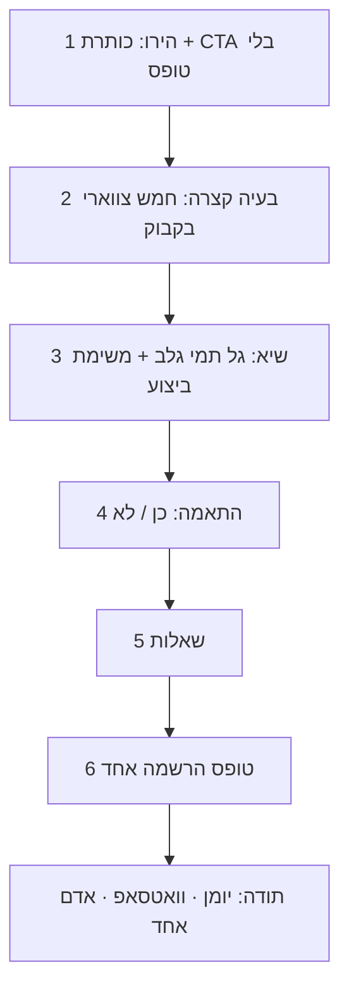

# סקיצת UX — דף הוובינר

איור לפני ביצוע. לא קוד. לא מחירים. לא CTA לספרייה.

התמונות ב־`docs/webinar-ux/` הן כיוון ויזואלי. **הקופי בדף נשאר של Infinite Masterpiece** («הכישרון כבר יש…», בלי הבטחת הכנסה). בשדות הטופס נשארים שלושה בשלב 1, לא שישה.

## מה משתנה

| עכשיו | בסקיצה |
| --- | --- |
| ~15 סקשנים באותו מקצב | 6 מקטעים |
| טופס בסקשן מסלולים + טופס בתחתית | טופס אחד בתחתית |
| «המקום נשמר תוך 20 שניות» | ספירה אמיתית לתאריך |
| אות ראשונה במקום פנים | שלושה דיוקנאות מלאים |
| סטיקי מכסה את הטופס במובייל | סטיקי נעלם כשהטופס במסך |
| דף תודה + קישור למחירון | שלושה צעדים: יומן, וואטסאפ, אדם אחד |
| פוטר עם מחיר / הססנים / ספרייה | הרשמה, שאלות, תנאים, נגישות |

## זרימת הדף

סקשן המסלולים: משפט אחד. שני מסלולים יוצגו בסוף הערב. בלי טופס ובלי ₪.

## מובייל

- בהירו: כפתור זהב אחד. סטיקי רק אחרי גלילה.
- כשהטופס במסך: אין סטיקי.
- שדות מיושרים לימין.

## לא בסקיצה

מונה חי מדומה, פופאפ יציאה חדש, תגובות, CTA לספרייה, מחיר אמיצים/הססנים, טופס שני.

סקיצת ההמשך (טופס בשלב אחד, תודה, ערב האירוע): [`WEBINAR-CX-SKETCH.md`](./WEBINAR-CX-SKETCH.md).
